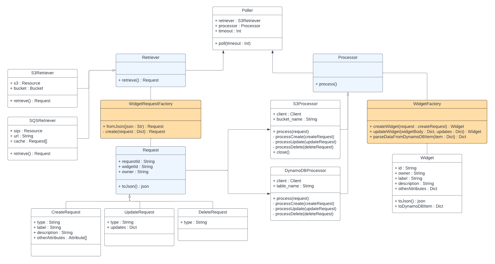

# **Consumer Program**

## Questions from HW3
1. Why is possible that Update and Delete Widget Requests may fail, even when you were 
running just one Consumer? Because of the way messages are obtained from the queue, it is not guaranteed that the request to create the widget that we are updating/deleting has been processed before the update/delete request.
2. How would this possible behavior impact the design of distributed applications that use 
queues? When distributing an application, it is important to anticipate this situation. Careful consideration should be taken to ensure that a message is not consumed/deleted unless it is properly cared for. If an object that we are meant to update/delete is not there, leave the message in the queue. Eventually, it will be picked up again and processed.

## **Overview**

The consumer program accepts four parameters:
1. retrieval source type - *s3*
2. retrieval source name - *bucket name*
3. process destination type - *s3, dynamodb*
4. process destination name - *bucket name, table name*

 The responsibilities of this program are divided primarily into three objects - a **Poller**, a **Retriever**, and a **Processor**.

### **Poller**
The poller manages the looping nature of the program. Composed of both a retriever and processor, the poller instructs the retriever to retrieve and, if needed, the processor to process the retrieved request. If no request is retrieved, the poller awaits a specified timeout duration and tries again. In the case of 5 consecutive failed retrievals, the program exits.

### **Retriever**
Using Boto3, the retriever obtains JSON requests from the specified source. It uses a **WidgetRequestFactory** to translate the request from JSON to a **Request** object and returns it to the poller.

### **Processor**
The processor obtains the request object and determines the request type. Currently, only *create* is supported. The processor then processes the request according to its type. In the case of a create request, the item is uploaded to the specified resource via Boto3.

## **Additional Visualization**

